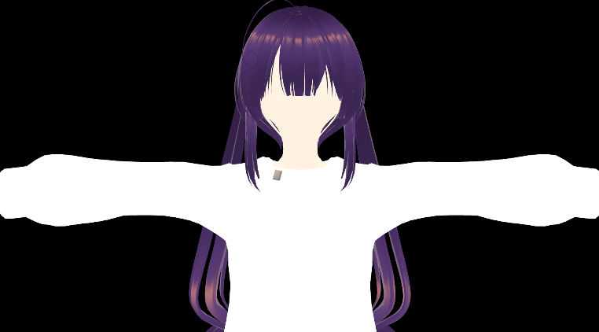
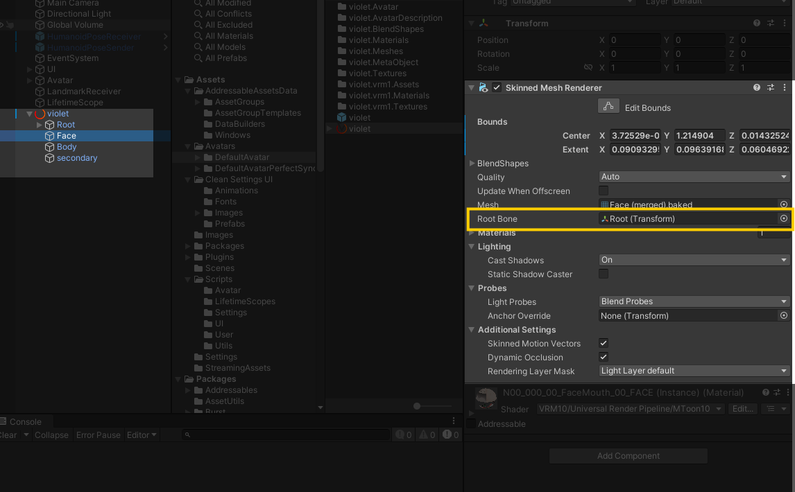

# VRM アバターを動かす際に顔が表示されない問題の対処

アバタートラッキングアプリを作成中に，顔が表示されない問題に当たった．


## 環境

- Unity 2022.3f22
- UniVRM v0.129.2
- アバターは VRoid 2.3.0 製

## 再現方法

VRoid 2.3.0 で作成した VRM アバターを UniVRM でロードし，`var bone = animator.GetBoneTransform()`で取得した Root 以外のボーンに対し position, rotation への値の代入によってアバターを動かす

## 原因

アバターの SkinnedMeshRenderer の RootBone が Root に設定されているため，Hips 以下が動かされてもバウンディングボックスが追従しない．アバターが大きく動くとき，それに追従したカメラの画角がこのバウンディングボックスから外れることで描写されなくなる．



### 補足: SkinnedMeshRenderer の Bounds

バウンディングボックス．これがカメラ内にあるうちは，その SkinnedMeshRendere を描画してくれる[1]．

## 対処

対処法の一つを示す．

手順は次のとおり:

1. SkinnedMeshRenderer の RootBone を適切なものに割り当てる
2. bounds のローカル位置がずれているので，これを(0,0,0)にリセットする

ターゲットとなるボーンを取得し，SkinnedMeshRenderer の rootBone に設定する．

```csharp
var rootBoneType = HumanBodyBones.Head;  // 望みのものに書き変えてください．
var bone = animator.GetBoneTransform(rootBoneType);
if (bone != null)
    target.rootBone = bone;
```

bounds の center がずれているので調整する．所望のボーンに rootBone を割り当てられているのであれば，ローカル位置を(0,0,0)にリセットすればいい．

bounds は構造体であり，また Unity では with 式が使えないので，編集した bounds 構造体全体を代入する．

```csharp
var recenteredLocalBounds = target.localBounds;
recenteredLocalBounds.center = Vector3.zero;
target.localBounds = recenteredLocalBounds;
```

コード全体

```csharp
void AdjustBounds(SkinnedMeshRenderer target, Animator avatarAnimator, HumanBodyBones rootBoneType)
{
  var bone = avatarAnimator.GetBoneTransform(rootBoneType);
  if (bone != null)
  {
      target.rootBone = bone;

      var recenteredLocalBounds = target.localBounds;
      recenteredLocalBounds.center = Vector3.zero;
      target.localBounds = recenteredLocalBounds;
  }
}
```

## References

1. Unity Technologies, Skinned Mesh Renderer コンポーネント, [Online]https://docs.unity3d.com/ja/2022.3/Manual/class-SkinnedMeshRenderer.html, Publication 2022.3, refered at 2025.8.24
