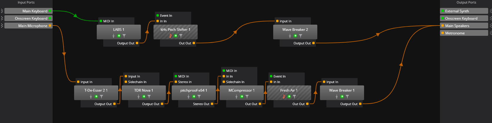

# ボイスチェンジャーを利用して弾き語りをするための環境構築

ボイスチェンジャーの用途の一つは会話でしょうが，もう一つの主要な用途は歌唱ではないでしょうか．

歌唱にあたっては，伴奏の類が欲しくなります．であれば，楽器の演奏と歌唱の両方をサポートできれば，この需要は満たせそうです．

本稿では，ボイスチェンジャーを使った弾き語りを環境の一例を説明します．

## 最重要の前提：とにかく遅延をなくせ

弾き語りにおいて致命的な問題となるのがループバックの遅延です．

まず，ループバックを聞くことは避けられません．音高や発声を調整するのに必要だからです．
しかし，弾き語りでは，演奏と歌唱のタイミングを合わせなければいけませんから，遅延は許容できません．タイミングが合わせづらいだけでなく，リズムに乗ることも困難になります．

したがって，この記事で紹介する環境を構築する前に，まずは皆さんの環境における音声の遅延を弾き語りに問題ない程度まで軽減してください．

**本稿では，その具体的な遅延軽減の方法については説明しません．** あくまで，遅延が十分に小さい環境がすでにある，という前提で話を進めます．（手が空いたら別途記事にします．）

## 構築例 1：MIDI ピアノで演奏する場合

楽器として MIDI ピアノを利用する場合，MIDI 入力信号を音声信号に変換する必要があります．この変換処理として，VST インストゥルメント（VSTi）という VST プラグインの一形式が利用できます．

これは，VST プラグインと併せて，Cantabile（VST ホスト）で利用可能です．音声入力とともに，MIDI 入力ポートを設定すれば，あとはプラグインの設定のみで事が済みます．

私の環境は以下のようになっています．

図のように，Cantabile の中で 2 つの処理系統が並行して動いています．上の経路が楽器演奏のもの，下の経路が声のものです．

1.  **楽器の系統:** MIDI 信号（例: 「ドの音をこの強さで弾いた」）を受け取り，VSTi がその情報に基づいてピアノの音を生成します．LABS 1 が楽器音源であり，その後のものは単なる音声の加工のためのプラグインです．
2.  **声の系統:** マイクからの音声を受け取り，ボイスチェンジャーやその他処理を通して声にエフェクトをかけます．

最終的には，これら 2 つの音が混ざってに出力されます．

以下にデモを示します．

<!-- ここにでも映像を添付する -->

（映像の逆向きピアノロールは，MIDI 入力を受け取ってその場で反映したものです．）

演奏の処理も加工の処理も，VST ホスト内で完結します．簡便な方法ですが，音声の個別出力ができません．

個別出力をしたい場合，[構築例 2: ギターやベースを利用する場合]の構成を利用してください．

## 応用例：ピッチシフターでキーを変更する

この環境の強力な利点の一つは，VST プラグインによる柔軟な音声加工です．例えば，曲のキー（音の高さ）が自分の声域に合わない場合に，VST プラグインの「ピッチシフター」を使って対処できます．

方法は 2 つあります．

1.  **楽器の音を変える:** MIDI の信号を移調（トランスポーズ）するか，VSTi の音自体を上げ下げする．
2.  **曲全体の音を変える:** 最終的にミックスされた音すべてをピッチシフターにかける．

これを利用したデモとして，うみろ様制作の楽曲『満ちていく』を弾き語りした際の例を紹介します．この曲は原曲のキーが高めなのですが，全体のピッチを少し下げることで，私の声域でも無理なく歌えるように調整しています．

このように，自分の声やその日のコンディションに合わせて，瞬時にキーを調整できるのも，この環境の大きな魅力です．

## 構築例 2: ギターやベースを利用する場合

ギターやベースを利用する場合，音は音声として入力することになると思います．

この場合，Cantabile に取り込むことができますが，ボイスチェンジャー用に構築した経路を通ることになるので，音に望まぬ加工が入ります．一方で，エフェクトを無効にした場合，ボイスチェンジャーが利用できません．

つまり，Cantabile 単体では不可能です．

そこで，力業を利用します．別のホストアプリをもう起動してください．

私は Cantabile と Studio One の両方を利用しています．
（Cantabile を二つ起動できれば良かったのですが，やり方が分かりませんでした）

Cantabile には B2 を，Studio One には B3 を参照させ，どちらも VIRTUAL INPUTS Voicemeeter AUX に出力します．VIRTUAL INPUTS Voicemeeter AUX に流れた音声を B1 に出力すれば，相手には演奏と歌唱の両方が聞こえます．

それぞれの出力先を別のものにすれば，演奏と歌唱を分けて管理することができます．たとえば，Cantabile の出力を VIRTUAL INPUTS Voicemeeter AUX に，Studio One の演奏を VIRTUAL INPUTS VAIO3 に割り当てれば，それぞれの出力先や音声を個別に調整できます．

<!-- TODO: 経路のイメージ図を示せ -->
<!-- TODO: Voicemeeterの設定を示せ -->

<!-- デモ演奏の動画を貼りつけろ -->

この方法は面倒で重たいですが，柔軟です．

## まとめ

この環境を構築できれば，心のゆくままに電波ソングが歌えますね．一緒ににゃんにゃんしていきましょう．
