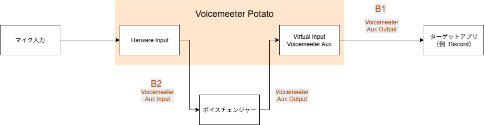
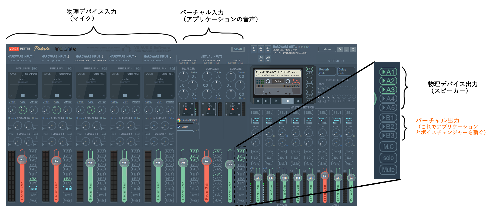
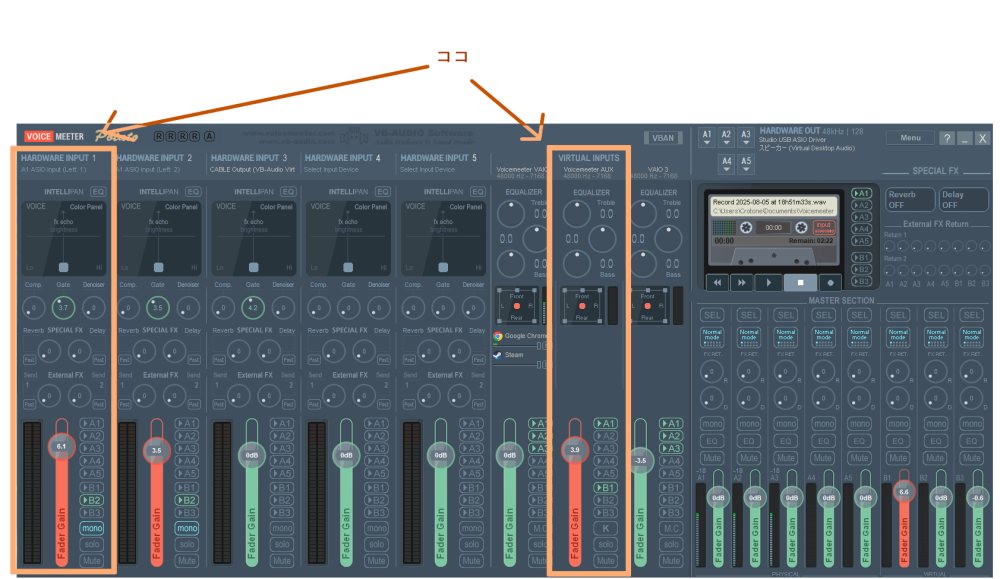

# ボイスチェンジャーを利用するための音声経路の整備

石射です．趣味で少女をやっています．

少女をやっていくにあたって，音声コミュニケーションは避けがたいものです．
VRChat や Discord のようなリアルタイム・コミュニケーション・ツールはもちろん，FPS などの協力型ゲームをやるときでさえ，音声コミュニケーションは日常的によく利用されています．それゆえ，ボイスチェンジャーは欠かせません．

しかし，基本的に，ボイスチェンジャーで変換した音声はそのままアプリに流せるようにはなっておりません．
したがって，会話用途でボイスチェンジャーを利用する場合，音声の流れを整備してやる必要があるのです．

## ボイスチェンジャーアプリはそのままでは会話に使えない

現在のボイスチェンジャーアプリは，それ単体では会話に使えません．

恋声，バ美声，Supertone Shift などの諸ボイスチェンジャーアプリは，基本的に，音声を受け取り，音声を出力します．
この入出力項目で設定するのは，デバイスです．音声入力の設定では使用するマイクを設定し，音声出力ではスピーカーを設定します．

そうすると，変換後の音声を自分で聞くことはできます．しかし，これでは，Discord や VRChat のような，変換後の音声を伝えたいアプリに音声を流し込むことができません．つまり，変換後の音声を他人に聞かせることができないのです．

ですから，音声出力を受け取り，それを目的のアプリ（Discord など）に伝えるための仲介役が必要です．
仮想デバイス（e.g. VB-CABLE）を使えば，この問題は解決できます．

ただ，本稿では，利便性を考慮して，より実用的な構成を説明したいのです．

皆さんには日常生活があります．趣味で少女をやっているからといって，仕事でも少女でいることが許されるわけではありません．
つまり，切り替えが必要です．このような制御の必要性や利便性を考えると，もう少し込み入った設定をしておくとよいです．
こうした快適性は，日常利用において特に重要です．ここがおろそかだと，面倒になって少女をやめたくなってしまいます．

この記事では，ボイスチェンジャーを会話において日常利用するための，**音声の経路**の整備のためのアプリとその設定について説明します．

## 要求

経験上，指針を決めると，すべきことが明確になることが多いです．この記事でも同様に，次の 3 つの指針を定めます．

- ターゲットアプリケーションの設定が容易
- ボイスチェンジャーの On/Off の切り替えが容易
- ボイスチェンジャーアプリが落ちたときに地声を晒さない

これらについて，順に説明します．

### ターゲットアプリケーションの設定が容易

私達が音声会話を行うアプリケーションは多岐にわたります．Discord や Skype などの音声通話サービス，VRChat や Resonite のようなソーシャル VR アプリはもちろん，オンラインゲームなどもその対象になりえます．

これらすべてに対し，共通の設定を使いまわすことができれば，利用と管理は簡単になります．
特に，「規定のデバイス」を変える必要が無い状態にできれば，設定が不要になります．

つまり，地声を用いるか変換後の声を用いるかなどの途中経路によらず，最終出力となる仮想デバイスを常に一定にできるとよいです．

### ボイスチェンジャーの On/Off の切り替えが容易

私達には日常生活があります．
趣味で少女をやっているからといって，常に少女でいることが許されているわけではありません．

仕事の際に少女の声で会話をすると，仮に怒られることがなかったとしても，あなたの趣味を知らない人には混乱を与えるでしょう．

また，家族や友人に少女の振る舞い知られてしまえば，エロ布を着てダンスポールに胸をこすりつけながら M 字開脚をすることが難しくなります．

乙女の振る舞いは秘することで守られるのです．

日常生活と趣味とを両立するためにも，ボイスチェンジャーの On/Off の切り替え操作の容易性にも気を配る必要があります．

### ボイスチェンジャーアプリが落ちたときに地声を晒さない

趣味で少女をやる以上，その奥にいる成人男性の気配を出すわけにはいきません．

アプリケーションというのは様々な理由で落ちるものです．しかし，このとき，地声を晒すことはうれしくありません．地声を晒すくらいなら，声自体を届かなくする方がよいでしょう．このようなセーフティネットが実現できると望ましいです．

乙女の魅力は秘することで守られるのです．

## 構成

こうした要求に基づく音声経路の整備には，オーディオミキサーを用います．Voicemeeter です．以下の経路が実現できるのであれば，Banana でも Poteto でも構いませんし，VB Matrix でも構いません．

本稿では，私が利用している環境として，Voicemeeter Poteto を用いた環境について説明します．

### 概要

Voicemeeter は入出力にそれぞれ仮想デバイスを持っています．この仮想デバイスを用いて経路を確立します．

音声の入力と出力を Voicemeeter で包み，その内部でボイスチェンジャーを経由させるイメージです．

以下は経路のイメージ図です．

### オーディオミキサー（Voicemeeter Potato）

Voicemeeter はオーディオミキサーです．音声を混ぜたりできるものとお考え下さい．
本稿の用途においては，経路を整えるためのアプリと認識すれば十分です．

以下は Voicemeeter Potato の説明です．

入力，出力それぞれに物理デバイス用のチャンネルとバーチャルチャンネルがあります．

バーチャル入力は，アプリケーションの音声を受け取る場所です．あなたが利用してるヘッドホンなどへの出力は，このチャンネルを経由し，物理デバイス出力（A1, A2, ...）に流すことでなされます．

バーチャル出力は，仮想的マイクデバイスに向けて音声を出力します．

会話のためにボイスチェンジャーを利用するには，このバーチャル入出力を利用して，音声をボイスチェンジャーに仲介させます．

私の設定では，次の流れをたどります．

1. マイク入力が HARDWARE INPUT 1 に流れる
2. HARDWARE INPUT 1 から B2（仮想マイク， "VoiceMeeter Aux Input"）に音声を横流しする
3. B2 の入力をボイスチェンジャーが受け取り，変換し，VoiceMeeter Aux Input（UI において VIRTUAL INPUTS Voicemeeter AUX に対応する仮想スピーカー）に変換後の音声を出力する
4. VIRTUAL INPUTS Voicemeeter AUX に流れ込んできた音声を B1（仮想マイク， "Voicemeeter Input"）に横流しする

また，変換後の音声を確認するため，VIRTUAL INPUTS Voicemeeter AUX の A1 を有効にしています．これによってループバックを実現しています．

### ボイスチェンジャー・アプリ

音声デバイスを入出力に用いるものであれば，任意のものを用いていただいてかまいません．基本的に，あらゆるボイスチェンジャーアプリがそうなっているはずです．

Pitchproof や Grallion などの VST プラグインを使用する場合，それを実行するための環境（VST ホストや Digital Audio Workstation: DAW）を利用してください．

## 設定

各アプリにおける具体的な設定を説明します．

### Voicemeeter の設定

はじめに，変換前の音声が流れるチャンネル，変換後の音声が流れるチャンネル，最終出力チャンネルを設定しましょう．私は次のように設定しています．

- 変換前：B2
- 変換後：Virtual aux Inut
- 最終出力：B1

この場合，B2 はボイスチェンジャー以外では参照しないようにしましょう．
B1 は最終出力です．規定の入力デバイスに設定しましょう．

設定は次のようになります．

HARDWARE INPUT 1 の B2，および，VIRTUAL INPUTS Voicemeeter AUX の B1 のボタンをクリックして光らせればいいです．

ループバックを聞きたい場合は，VIRTUAL INPUTS Voicemeeter AUX の 物理デバイス出力チャンネル（A1, A2,...）をクリックして有効にしてください．

### ボイスチェンジャーアプリの設定

大抵のボイスチェンジャーアプリは，音声入力デバイスと音声出力デバイスとを設定することができます．ここに適切な仮想デバイスを設定すればよいです．

- 入力に VoiceMeeter Aux Input（B2 に対応）を設定
- 出力に VoiceMeeter Aux Output（VIRTUAL INPUTS Voicemeeter AUX に対応）を設定

### 備考：よりコンパクトだけど危ない音声経路

上の構成では，中間音声が通るチャンネルは使えません（B2 と VIRTUAL INPUTS Voicemeeter AUX）．

しかし，Voicemeeter では，よりコンパクトな方法をとることができます．insert を使う方法です．

**設定方法（うろ覚え）**

1. マイクの出力先を，最終出力チャンネル（私の場合は B1）にします．
2. System setting から，PATCH COMPOSITE を指定します
3. ボイスチェンジャーは，この insert に対応するデバイス（"ASIO - Voicemeeter Insert Virtual ASIO"）を参照させます

そうすると，チャンネル内の音声経路の**途中**でボイスチェンジャーが挿入されるようになる[^1]ため，使えないチャンネルが生じません．よりコンパクトな方法です．

[^1]: 実際の動作は知りません．ただ，雰囲気として，そのようになっている印象を私が勝手に受けています．

しかし，この構成では，ボイスチェンジャーが落ちた場合，**地声**が相手に伝わります．

前述の構成は，ボイスチェンジャーが動作していない場合，B2 と B1 とを橋渡しする存在がなくなりますから，音声が流れることはありません．
冗長な代わりに安全です．

冗長な構成では，ボイスチェンジャーの起動し忘れや事故による地声の流出を防止することができます．趣味で少女をやる用途においては，より適切な方法と考えます．

とはいえ，Insert によるコンパクトな構成が悪いということはありません．生の音声（この場合，地声）が漏れても問題ないケースであれば，より良いでしょう．どちらが良いかは目的によります．

## 使い方

基本的には，次のことに留意すればよいです．

**最終出力は B1**

各ターゲットアプリのマイク入力は，VoiceMeeter Output（B1）を設定すればいいです．

ボイスチェンジャーで変換した音声に限らず，B1 に流せばどんな音声でも相手に伝えることができます．

**変換のための入力は B2**

どんな入力でも，B2 に設定したものはボイスチェンジャーに取り込まれて変換されます．

**VIRTUAL INPUTS Voicemeeter AUX はモニター用**

VIRTUAL INPUTS Voicemeeter AUX は変換後の音声が経由する場所です．
結果が聞きたい場合は，このチャンネルの音声出力デバイス用チャンネル（A1, A2, ...）を有効にしましょう．

また，このチャンネルを他のアプリの出力として割り当てるべきではありません．出力に余計な音が混じってしまいます．

以下では，日常的に行われるいくつかのケースについて，実際に行う操作を説明します．

### 地声とボイスチェンジャーの声との切り替え

次のいずれかでできます：

1. マイク入力を受け付けている HARDWARE INPUT の B1 を有効にする
2. ボイスチェンジャーの設定を変える（変換せずに素通しする）

ループバックと最終出力とが一致するのは方法 2 です．したがって，ボイスチェンジャーアプリ側で簡単に切り替えられる場合，方法 2 を用いる方が安全です．

方法 1 は注意が必要です．方法 1 を用いる場合，設定の戻し忘れによって，ループバックでは少女の声が聞こえているのに相手には成人男性の声が聞こえているという事故が発生する可能性があります．

### 新たな音声通話アプリケーションを利用する場合

音声入力に VoiceMeeter Input（B1）を設定すればいいです．

### 新たなボイスチェンジャーアプリを利用する場合

入力に VoiceMeeter Aux Input（B2）を設定し，
出力に VoiceMeeter Aux Output（VIRTUAL INPUTS Voicemeeter AUX） を設定しましょう．

複数のボイスチェンジャーを同時に利用することはできないので，使ってない方のアプリは落としておいてください．

（両方使うと，両方の出力が混じった音になると思います）

### 遅延が大きい環境下においてボイスチェンジャーを利用する場合

ループバックの遅延が 0.2 秒程度あると発話が困難になることが報告されています[@kurihara_speechjammer_2012]．

この程度の遅延は，利用するボイスチェンジャーや音声入出力デバイスなどによって簡単に生じます．
このような場合，ループバックはいっそ聞かない方がいいです．

ループバックを無効にするには，VIRTUAL INPUTS Voicemeeter AUX のデバイス出力（e.g. A1, A2）を無効にすればよいです．

変換後の音声が聞こえないため，発声等の調整には困難が生じますが，システムを信じるか，あるいは気合で乗り切りましょう．

### 音声の録音

音声は B1 から出力されますから，マイクのデバイスを VoiceMeeter Input に設定するだけです．あとは，録画・録音ボタンを押せば変換後の音声が入ります．

### 他のアプリケーションの音声の共有

少し応用的な使い方です．

YouTube の音声などをその場で即時に伝えたい場合，そのアプリが入力されている Virtual Input の B1 を有効にすればいいです．そうすると，音声がそのまま出力にも流れます．

VoiceMeeter や設定した音声経路を理解していれば，このような応用が利かせられます．意外と便利です．

## 最後に

この構成の利点は，モジュールが簡単に入れ替えられる点にあります．

ボイスチェンジャーアプリは，常に VoiceMeeter Aux Input を入力にし， VoiceMeeter Aux Output を出力にすればいいです．この設定をしている限りにおいて，任意のアプリが利用できます．
地声を利用したい場合，その設定はボイスチェンジャーか Voicemeeter で実現されます．どう設定しようとも，最終出力が B1 であることに変わりはありません．

したがって，ターゲットアプリケーションは中間経路の変更の影響を受けません．経路はどうあれ，B1 をマイク入力に設定すればいいです．

デバイスが変わろうとボイスチェンジャーアプリが変わろうと，経路が変わることはありません．

この明瞭さは，ボイスチェンジャーの導入により複雑化したシステムに秩序をもたらし，トラブルシューティングなどを多少マシにしてくれます．
