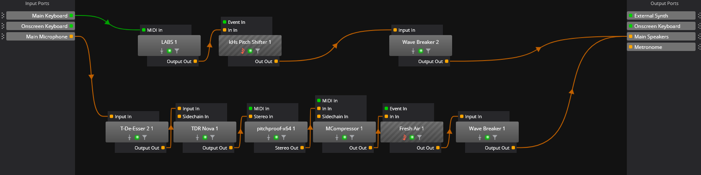
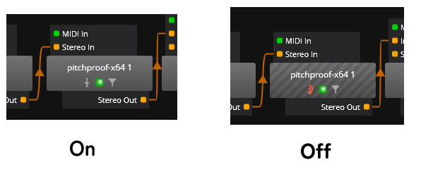

# VST プラグインのボイスチェンジャーを利用するためのアプリと設定

ボイスチェンジャーには Pitchproof や Graillon のような VST プラグインのものが存在します．これらは，単体では動作しません．プラグインを用いて音声処理をするためのホストをするアプリケーションが必要なのです．

<!-- ここに目次 -->

VST プラグインは「プラグイン」であり，アプリではなく部品のようなものです．それ単体では動作しません．

このプラグインを読み込んで実行するためのホストとなるアプリケーションが必要です．

実行するアプリとして，Reaper などの DAW や Cantabile などの VST ホストを使うことができます．

DAW は音楽制作の諸機能を豊富に含んでいますが，その分重いです．単に会話用途で用いるなら，より軽量な VST ホストを用いる方がよいでしょう．

## 構成例：VST ホストと VST プラグイン

私が実際に利用している構成を例として紹介します．

主に，次のものを利用しています．

- **ホストアプリ:** [Cantabile Lite](https://www.cantabilesoftware.com/download/)
- **ボイスチェンジャー** [Pitchproof](https://aegeanmusic.com/pitchproof-specs)

プラグインは，下図のようにつないでいます．2 列ありますが，下側が音声の処理です．

ボイスチェンジャーとして Pitchproof を利用しています．その前後で，ディエッサー，イコライザー，コンプレッサー，リミッターを使用しています．

ボイスチェンジャーの On/Off の切り替えは，ボタンをクリックすることでできます．

VST ホストの前後の音声経路は，Voicemeeter の仮想オーディオデバイスによって整備しています．内容は以下の記事に記述しています．

[ボイスチェンジャーを利用するための音声経路の整備](https://note.com/ec_k/n/nedbecb01c36a)

## 付録：VST ホスト + VST プラグイン形式のボイスチェンジャー環境の利点

あえて VST プラグイン形式のボイスチェンジャーを利用する理由は，案外，「そのプラグインの性能が良かったから」だったりすると思います．したがって，VST プラグインという形式の利用は，その結果として付随するものでしょう．

ただ，ここではあえて，VST プラグインという利用形態に関する，個人的に感じた利点を紹介します．

### 音作りの自由度と品質 (vs 非 VST プラグインのボイスチェンジャー)

VST プラグインはボイスチェンジャーに限らず多種多様な音声処理ができます．

例えば，私の構成では，ディエッサーやイコライザーで余計な音域を消し，ボイスチェンジャーで声を変換したあと，コンプレッサーとリミッターで音量調節をしています．このような事前・事後の処理をフローに簡単かつ柔軟に組み込めるのは，VST プラグインを利用した場合の利点です．

また，ボイスチェンジャー用のプラグインを無効にすれば，この音声処理は地声にも利用できます．仕事等の日常生活において地声で会話する際に，その音声をリッチにすることができます．つまり，ボイスチェンジャーとしてでなく，より広範な用途で利用できるということです．

### VST ホストは軽量 (vs DAW)

VST ホストは DAW と比べて軽量です．それゆえ，立ち上がりが早く，また，常駐させていても PC への負担が小さいです．

特に，Cantabile はシステムトレイに常駐させておくこともできるため，使いたいときにすぐに使える状態を維持しつつ，Alt+Tab などでウィンドウを切り替える際に Cantabile のウィンドウが現ないため，その他の活動を阻害することがありません．

こうしたことから，日常利用において非常に優れていると感じます．

**補足：その他の VST ホストについて**
上述の「システムトレイに常駐させられる」という性質は，Cantabile 特有のものかもしれません．他の VST ホストを利用する際には注意が必要です．

## まとめ

基本的には，利用したいボイスチェンジャーが VST プラグインだった場合に本稿を参考にしていただければと考えます．
